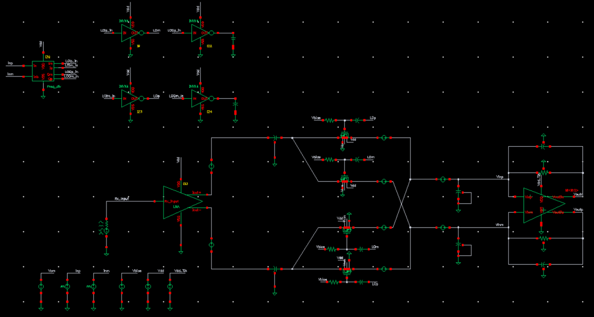
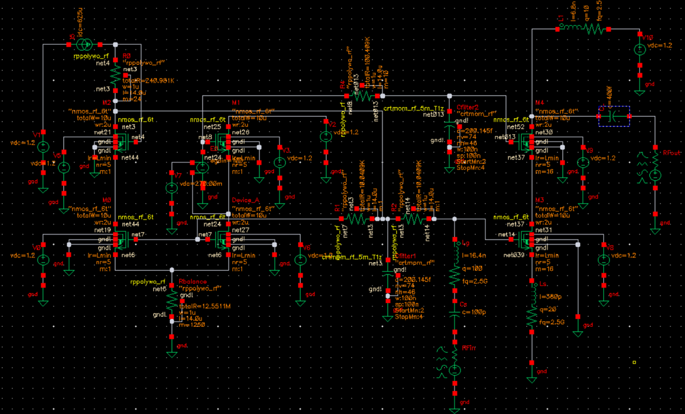
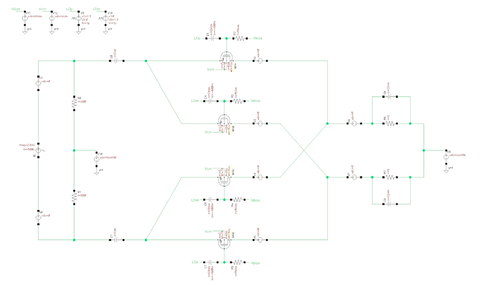
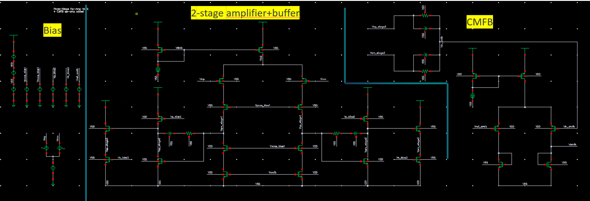
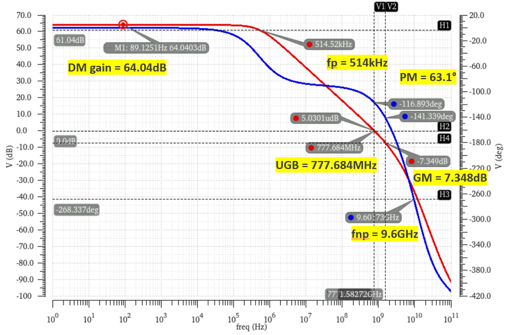
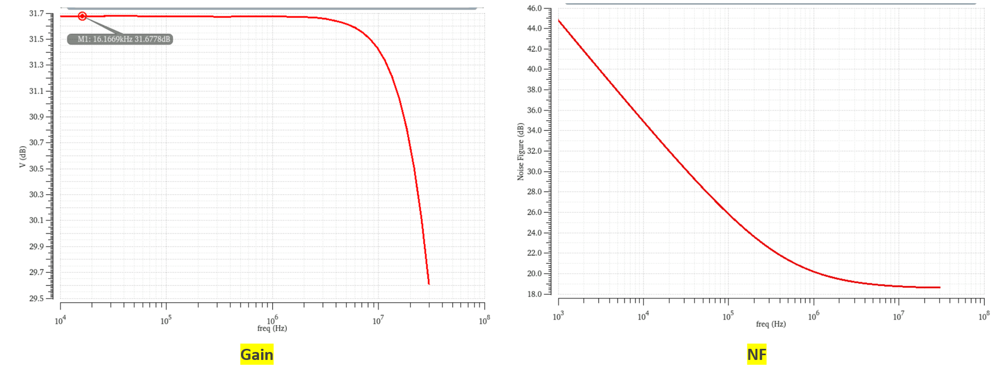

# 2.1–2.7 GHz Direct-Conversion Receiver Front-End (TSMC 65nm)

## 📌 Executive Summary
This repository details the full-custom IC design, optimization, and system-level verification of a **2.1–2.7 GHz Zero-IF (Direct-Conversion) Receiver Front-End**, implemented in the **TSMC 65nm CMOS process**. Designed to meet the stringent requirements of modern 4G/5G cellular bands (B1/B7/B38/B41).

Unlike standard academic projects, this design strictly addresses **industrial-grade challenges**:
1. **PVT-Invariant Biasing:** Designed a custom OpAmp-assisted replica bias network for the LNA, limiting DC current drift to **< 1.5%** across extreme PVT corners (-40°C to 125°C).
2. **Multi-Pole Frequency Compensation:** Architected and stabilized a high-gain **3-stage baseband OpAmp (GBW = 900 MHz, Phase Margin = 63°)** using Zero-Nulling Miller Compensation to drive heavy TIA loads.
3. **LO/Mixer Reliability:** Optimized a 50% duty-cycle passive mixer targeting strict Time-Dependent Dielectric Breakdown (TDDB) limits while maximizing IIP3.

---

## 🏗️ System Architecture

The Zero-IF architecture was chosen for its high integration capability, completely eliminating the need for off-chip IF SAW filters. The front-end consists of three primary blocks:

1. **Cascode Low Noise Amplifier (LNA):** Employs inductive source degeneration for simultaneous noise and power matching.
2. **Current-Mode Passive Mixer:** Uses a 50% duty-cycle local oscillator (LO) to eliminate DC power consumption and 1/f noise. Terminating the mixer into a low-impedance TIA preserves high system linearity while significantly easing the design complexity and power requirements of the LO generation network.
3. **Baseband Transimpedance Amplifier (TIA):** Converts the down-mixed RF current into a baseband voltage while providing 1st-order low-pass filtering.

*(Fig 1. High-level architecture of the Direct-Conversion Receiver)*

---

## 🔬 Core Module Design & Engineering Trade-offs

### 1. Low Noise Amplifier (LNA) & PVT-Invariant Bias Network
The LNA features a cascode topology to minimize the Miller effect and improve reverse isolation ($S_{12}$). A critical design focus was placed on the biasing network to combat severe channel-length modulation and threshold voltage shifts across process corners.

* **Simultaneous Matching:** Input matching was achieved using a source degeneration inductor ($L_s \approx 187 \text{ pH}$) to generate a real $50\Omega$ input resistance without thermal noise penalty, and a gate inductor ($L_g \approx 18.6 \text{ nH}$) to tune out the imaginary part of $C_{gs}$.
* **Advanced Biasing (The "Replica + OpAmp" Approach):** A standard current mirror fails under extreme PVT variations due to $V_{ds}$ mismatch. I introduced a scaled-down replica branch combined with an auxiliary high-gain OpAmp loop. The negative feedback dynamically locks the $V_{ds}$ of the main RF transistor to the replica's $V_{ds}$. 
* **Result:** DC current variation was suppressed to merely **1.1% at nominal** and **< 5.5% at extreme Slow/Fast corners**, achieving a highly robust **NF of 1.45 dB** and **IIP3 of -14.2 dBm**.

*(Fig 2. LNA schematic featuring the OpAmp-assisted PVT-invariant bias network)*

### 2. 50% Duty-Cycle Passive Down-Converter (Mixer)
Active Gilbert-cell mixers introduce severe flicker (1/f) noise, which is fatal for baseband signals at DC (0 Hz). Thus, a purely passive switching quad driven by a 50% duty-cycle LO was implemented to eliminate DC current consumption.

* **Current-Mode Operation:** To maintain the inherent high linearity of the passive switches, the mixer is terminated into the low input impedance of the subsequent TIA. This prevents large voltage swings at the mixer output, minimizing $V_{gs}$ modulation and achieving an outstanding system IIP3.
* **TDDB-Aware Biasing:** To minimize switch $R_{on}$ ($2.5\ \Omega$) without breaking the 65nm process TDDB limit ($1.2\text{ V}$), the gate bias was meticulously calculated. The LO swing was maximized to $1.2\text{ V}$ ($0.6\text{ V}$ to $1.8\text{ V}$ absolute), with an AC-coupled DC bias of $1.2\text{ V}$ to ensure proper switching.

*(Fig 3. Passive mixer schematic)*

### 3. Baseband TIA & 3-Stage Active-RC Filter
The TIA uses an $R_f = 750\ \Omega$ and $C_f = 5.1\text{ pF}$ to set the dominant baseband pole at 40 MHz. Driving such a heavy resistive load requires an OpAmp with extremely low output impedance and high DC gain, necessitating a 3-stage topology.

*(Fig 4. 3-Stage OpAmp Schematic)*

* **3-Stage OpAmp Architecture:** 
  * *Stage 1:* PMOS input differential pair with cascode (Gain = 35 dB).
  * *Stage 2:* NMOS common-source gain stage (Gain = 26 dB).
  * *Stage 3:* NMOS Source Follower buffer for impedance transformation.
* **Zero-Nulling Miller Compensation:** Cascading 3 stages introduces multiple low-frequency poles, causing severe instability. A Miller capacitor ($C_C = 40\text{ fF}$) was placed across the 2nd stage to split the dominant and non-dominant poles. To counteract the Phase Margin degradation caused by the Right-Half-Plane (RHP) zero, a nulling resistor ($R_Z \approx 1.4\text{ k}\Omega$) was introduced to push the zero to infinity.
* **Result:** The fully differential OpAmp achieved a **DC Gain of 64.04 dB**, a **GBW of 777.684 MHz**, and a highly stable **Phase Margin of 63.1°**. A dedicated Common-Mode Feedback (CMFB) loop was also implemented and verified to be unconditionally stable.

*(Fig 5. Bode plot of the 3-stage OpAmp demonstrating 63.1° Phase Margin)*

---

## 📊 Full-System Verification (SpectreRF)

The full chain (LNA $\rightarrow$ Passive Mixer $\rightarrow$ Baseband TIA) was simulated under large-signal LO drive using **Harmonic Balance (HB)** engines in Cadence SpectreRF.

* **PSS + PAC (Periodic AC Analysis):** Verified the frequency translation from 2.5 GHz to Baseband.
* **PSS + Pnoise (Periodic Noise Analysis):** Captured the complex noise folding effects from LO harmonics.

| Parameter | Simulated Value | Target / Notes |
| :--- | :--- | :--- |
| **RF Operating Band** | 2.1 – 2.7 GHz | B1/B7/B38/B41 |
| **Baseband Pole** | 38.7 MHz | Active-RC TIA Filter |
| **Total Conversion Gain** | 31.68 dB | Exceeded 30 dB specification |
| **System IIP3** | -50 dBm (3.16uA) | Current-mode termination maintains high linearity |
| **LNA DC Current Variation** | < 5.5% | Across -40°C to 125°C (PVT) |

*(Fig 6. Full-chain Conversion Gain and Noise Figure over the operating band)*

---

## 🛠️ Tools & Skill Sets Demonstrated
* **Analog/RF IC Design:** Noise/Power matching, Non-linear switching analysis, Multi-stage amplifier frequency compensation, CMFB design.
* **EDA Tools:** Cadence Virtuoso, ADE L/XL.
* **Advanced Simulation:** SpectreRF (DC, AC, Transient, **PSS, PAC, Pnoise, HB**), Stability Analysis (stb), Parametric Sweeps.
* **Analytical Modeling:** MATLAB used for extracting and validating transfer functions and S-parameters vs. CAD models.
